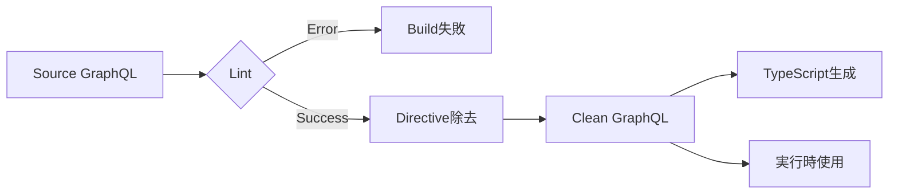

# GraphQL Fragment Argument Linter Spec（Draft）

## 1. 目的（Motivation）

本仕様は、GraphQL Fragment を **単なるフィールドの共通化**ではなく、

- fragment を **再利用可能な API 単位**
- fragment 引数を **明示的な契約（contract）**

として扱うための拡張仕様を定義する。

特に以下の問題を解決することを目的とする：

- fragment が内部で使用する variables の指定漏れ
- optional 引数に `null` が渡されることによる意味破壊
- defaultValue を持つ引数の安全な利用
- codegen時のlinterによる静的保証

本仕様は **GraphQL 実行仕様を変更しない**。  
すべては **静的解析（Lint）とTransform処理**で解決される。

- **Lint**: 型チェック、引数の検証、nullability検証
- **Transform**: Fragment Inlining、defaultValue埋め込み、directive除去

### 1.1 Directive のライフサイクル

本仕様で使用する directive（`@argumentDefinitions`, `@arguments`）は、
**codegen時にのみ存在し、lint通過後に除去される**。

```
開発時 GraphQL (directives あり)
    ↓
  Lint & Validation
    ↓
  ✅ 検証通過
    ↓
  Directive 除去
    ↓
実行時 GraphQL (標準GraphQL)
```

これにより：
- ✅ 実行時は標準GraphQL（Apollo、Hasuraで動作）
- ✅ Schema定義不要（directiveはcodegen専用）
- ✅ Relayと同じ思想（Relay Compilerと同様の動作）

---

## 2. 用語定義

### Fragment Argument
fragment 内部で使用される仮引数。Relay の `@argumentDefinitions` と同等。

### 呼び出し側
fragment を `...Fragment @arguments(...)` により展開する query / fragment。

### 未指定（omitted）
`@arguments` にそのキー自体が存在しない状態。

### null 指定
`@arguments(arg: null)` のように明示的に null が渡される状態。

### Lint Directive
codegen時の検証のみに使用され、検証通過後に除去されるdirective。
本仕様では `@argumentDefinitions`, `@arguments` が該当。

### Transform処理
Lint通過後、directive を除去して標準GraphQLに変換する処理。

---

## 3. 基本構文

### 3.1 Fragment 定義

```graphql
fragment TodoList_list on TodoList
  @argumentDefinitions(
    count: { type: "Int!", defaultValue: 10 }
    userID: { type: "ID!" }
  )
{
  title
  todoItems(userID: $userID, first: $count) {
    ...
  }
}
```

**引数の意味**:
- `count`: Optional（省略可能、defaultValue使用）、指定する場合は non-nullable
- `userID`: Required（必須）、non-nullable

---

## 4. Argument の意味論（Semantics）

### 4.1 Argument の分類と型システム

Fragment引数は `defaultValue` の有無と GraphQL型の nullability の組み合わせで分類される。

| defaultValue | type | 分類 | 省略 | null指定 | 値指定 |
|-------------|------|------|-----|---------|--------|
| なし | `T!` | **Required** | ❌ | ❌ | ✅ |
| あり | `T!` | **Optional（null禁止）** | ✅ | ❌ | ✅ |
| あり | `T` | **Optional（null許可）** | ✅ | ✅ | ✅ |

**禁止パターン**:
```graphql
# ❌ エラー: defaultValueなし + nullable型
@argumentDefinitions(
  arg: { type: "ID" }  # nullable だが defaultValue なし
)
```
→ Required引数は `type: "ID!"` と non-nullable で定義すべき

**設計思想**:
- **Required引数**: GraphQL型で `!` を使用
- **Optional引数**: `defaultValue` で表現
- 指定する場合のnullability: GraphQL型で表現（`T!` or `T`）

---

### 4.2 defaultValue の適用ルール

defaultValue は **引数が未指定の場合のみ適用**される。

| 呼び出し側 | 最終値 | 型チェック |
|----|----|----|
| 未指定 | defaultValue | - |
| 値指定 | 指定された値 | 型に従う |
| null 指定 | null | 型が `T` なら許可、`T!` ならエラー |

---

## 5. 型チェックルール

### 5.1 Required引数の検証

`defaultValue` を持たない引数は **required**（必須）とみなされる。

```graphql
@argumentDefinitions(
  userID: { type: "ID!" }  # Required
)
```

**検証ルール**:
- ✅ 必ず `@arguments` で指定されなければならない
- ❌ 型は non-nullable（`!`付き）でなければならない
- ❌ nullable型（`ID`等）でrequired引数は定義不可

---

### 5.2 Optional引数の検証

`defaultValue` を持つ引数は **optional**（省略可能）とみなされる。

```graphql
@argumentDefinitions(
  count: { type: "Int!", defaultValue: 10 }
)
```

**検証ルール**:
- ✅ 省略可能（defaultValueが使用される）
- ✅ 指定する場合は型に従う
- `T!`: null指定は禁止
- `T`: null指定も許可

---

## 6. 呼び出し側の検証ルール

### 6.1 Required引数の呼び出し検証

```graphql
@argumentDefinitions(
  userID: { type: "ID!" }  # Required
)
```

**エラーケース**:
```graphql
# ❌ 引数が指定されていない
...TodoList_list

# ❌ null を指定
...TodoList_list @arguments(userID: null)

# ❌ nullable variable を指定
query Q($userID: ID) {  # nullable
  ...TodoList_list @arguments(userID: $userID)
}
```

**正しいケース**:
```graphql
# ✅ 値を指定
...TodoList_list @arguments(userID: "123")

# ✅ non-nullable variable を指定
query Q($userID: ID!) {
  ...TodoList_list @arguments(userID: $userID)
}
```

---

### 6.2 Optional引数の呼び出し検証

```graphql
@argumentDefinitions(
  count: { type: "Int!", defaultValue: 10 }
)
```

**エラーケース**:
```graphql
# ❌ null を指定（型が Int! だから）
...TodoList_list @arguments(count: null)

# ❌ nullable variable を指定（型が Int! だから）
query Q($count: Int) {
  ...TodoList_list @arguments(count: $count)
}
```

**正しいケース**:
```graphql
# ✅ 省略（defaultValueを使用）
...TodoList_list

# ✅ 値を指定
...TodoList_list @arguments(count: 5)

# ✅ non-nullable variable を指定
query Q($count: Int!) {
  ...TodoList_list @arguments(count: $count)
}
```

---

## 7. 型定義の制約

### 7.1 Required引数の定義制約

Required引数（`defaultValue`なし）は **必ず non-nullable型** で定義する。

**✅ 正しい定義**:
```graphql
@argumentDefinitions(
  userID: { type: "ID!" }
  status: { type: "Status!" }
)
```

**❌ 誤った定義**:
```graphql
@argumentDefinitions(
  userID: { type: "ID" }  # nullable
)
```
→ Lint Error: "Required argument must be non-nullable. Use 'ID!' instead of 'ID'."

---

### 7.2 Optional引数の定義

Optional引数（`defaultValue`あり）は nullable/non-nullable どちらでも定義可能。

**パターンA: null禁止**
```graphql
@argumentDefinitions(
  count: { type: "Int!", defaultValue: 10 }
)
```
- 省略可能
- 指定する場合は non-nullable

**パターンB: null許可**
```graphql
@argumentDefinitions(
  filter: { type: "String", defaultValue: "" }
)
```
- 省略可能
- null指定も許可

---

## 8. Codegen（TypeScript）仕様

### 8.1 Fragment 引数型生成

GraphQL型定義からTypeScript型を生成する。

```graphql
@argumentDefinitions(
  count: { type: "Int!", defaultValue: 10 }
  userID: { type: "ID!" }
  filter: { type: "String", defaultValue: "" }
)
```

```ts
type TodoList_list_Args = {
  count?: number;          // optional, non-nullable
  userID: string;          // required, non-nullable
  filter?: string | null;  // optional, nullable
};
```

**型生成ルール**:
- `defaultValue`あり → `?:` (optional)
- `defaultValue`なし → 必須プロパティ
- 型が `T!` → null を含めない
- 型が `T` → `| null` を含める

---

### 8.2 Fragment Inlining後の型

Fragment Inlining後は引数型は不要（直接展開されるため）。

```typescript
// Before（Fragment定義時）
type TodoList_list_Args = { count?: number; userID: string };

// After（Inlining後）
// Fragment Argsは使用されない（展開されるため）
type GetTodosQuery = {
  todoList: {
    title: string;
    todoItems: Array<{ id: string }>;
  }
}
```

---

## 9. Linter / Plugin の責務

### 9.1 必須検査項目

**定義時の検証**:
- ✅ Required引数（`defaultValue`なし）が non-nullable型か
- ✅ 引数の型定義が有効なGraphQL型か

**呼び出し時の検証**:
- ✅ Required引数が `@arguments` に存在するか
- ✅ 渡された値の型が引数型と一致するか
- ✅ non-nullable引数に null が渡されていないか
- ✅ non-nullable引数に nullable variable が渡されていないか

---

## 10. Transform処理仕様

### 10.1 目的

Lint通過後、以下のdirectiveを除去し、標準GraphQLに変換する：

- `@argumentDefinitions`
- `@arguments`

これにより、実行時は標準GraphQLサーバー（Apollo、Hasura等）で動作可能となる。

---

### 10.2 Transform処理の流れ



---

### 10.3 変換例

#### Before（開発時）

```graphql
fragment TodoList_list on TodoList
  @argumentDefinitions(
    count: { type: "Int!", defaultValue: 10 }
    userID: { type: "ID!" }
  )
{
  title
  todoItems(userID: $userID, first: $count) {
    id
  }
}

query GetTodos($userID: ID!) {
  todoList {
    ...TodoList_list @arguments(userID: $userID)
  }
}
```

#### After（Lint通過 → Transform後）

**方式: Fragment Inlining**

```graphql
# Fragment定義は削除される（inline展開のため）

query GetTodos($userID: ID!) {
  todoList {
    # Fragment内容を直接展開
    title
    todoItems(
      userID: $userID,  # @argumentsで渡された値
      first: 10         # defaultValueを適用（リテラル値として埋め込み）
    ) {
      id
    }
  }
}
```

✅ **実行時は標準的なGraphQL**  
✅ **defaultValueはFragment内部で適用される**

---

### 10.4 Transform実装仕様

#### 10.4.1 Transform方式

本仕様では **Fragment Inlining方式** を採用する。

**Fragment Inlining方式**:
- Fragment使用箇所でFragment内容を直接展開
- `@arguments`で渡された値またはdefaultValueを直接埋め込み
- Fragment定義は削除される（全て展開されるため）

**設計理念**:
> Fragment引数はcodegen時の抽象化であり、実行時には完全に解決されるべき

---

#### 10.4.2 AST変換ルール

1. **FragmentSpread を SelectionSet に置換**
   ```
   FragmentSpread ノードを検出
   → Fragment定義の selectionSet を取得
   → FragmentSpread を selectionSet.selections で置換
   ```

2. **引数値の解決**
   ```
   @arguments から渡された値を取得
   → 未指定の引数は defaultValue を使用
   → required引数が未指定の場合はエラー（lint時に検出済み）
   ```

3. **Variable参照の置換**
   ```
   Fragment内の Variable ノードを走査
   → 引数値がリテラルの場合: Value ノードに置換
   → 引数値が$variableの場合: そのままVariable参照を維持
   → defaultValueの場合: リテラル Value ノードに置換
   ```

4. **Fragment定義の削除**
   ```
   全てのFragmentSpreadが展開された後
   → FragmentDefinition ノードを削除
   ```

---

#### 10.4.3 変換パターン

**パターンA: 引数を一部省略**

```graphql
# Before
query Q($userID: ID!) {
  ...TodoList @arguments(userID: $userID)
  # count省略 → defaultValue使用
}

# After
query Q($userID: ID!) {
  title
  todoItems(userID: $userID, first: 10) { id }
}
```

**パターンB: 引数を全て省略**

```graphql
# Before
fragment TodoList @argumentDefinitions(
  count: { type: "Int!", defaultValue: 10 }
  status: { type: "String!", defaultValue: "ACTIVE" }
) {
  items(first: $count, status: $status) { id }
}

query Q {
  ...TodoList
}

# After
query Q {
  items(first: 10, status: "ACTIVE") { id }
}
```

**パターンC: Variable参照を渡す**

```graphql
# Before
query Q($userCount: Int!) {
  ...TodoList @arguments(count: $userCount)
}

# After  
query Q($userCount: Int!) {
  title
  todoItems(first: $userCount) { id }
}
```

**パターンD: リテラル値を渡す**

```graphql
# Before
query Q {
  ...TodoList @arguments(count: 5)
}

# After
query Q {
  title
  todoItems(first: 5) { id }
}
```

---

#### 10.4.4 エラー時の動作

Lint失敗時は **Transform を実行しない**。

```
Lint Error → Build 失敗
           → エラーレポート出力
           → Transform 実行せず
```

これにより、不正なGraphQLが実行時に流れることを防ぐ。

---

#### 10.4.5 Fragment Inlining のトレードオフ

**✅ メリット**:
- Fragment引数の完全な解決（defaultValueが確実に適用）
- Query variableが汚染されない
- 実装がシンプル
- 実行時は完全に標準GraphQL

**⚠️ デメリット**:
- Fragment定義が消える（再利用はcodegen前のソースのみ）
- 同じFragmentを複数箇所で使うとコードが重複
- 生成されるQueryサイズが増加する可能性

**設計判断**: 
Fragment引数は「開発時の抽象化」であり、実行時には最適化された形で存在すべき。
コード重複よりも、引数の正確な適用と型安全性を優先する。

---

### 10.5 Codegen設定例

```typescript
// codegen.ts
import type { CodegenConfig } from '@graphql-codegen/cli';

const config: CodegenConfig = {
  schema: './schema.graphql',
  documents: ['./src/**/*.graphql'],
  generates: {
    // Lint + Transform（エラー時はビルド失敗）
    './generated/graphql.ts': {
      plugins: [
        {
          'graphql-fragment-argument-linter': {
            strictMode: true,
            requireExplicitTypes: true,
            
            // ✅ Transform有効化
            transformMode: 'inline',  // Fragment Inlining方式
            stripDirectives: true,
            
            // 除去対象directive
            directivesToStrip: [
              'argumentDefinitions',
              'arguments'
            ]
          }
        },
        // Transformされた後のクリーンなGraphQLで生成
        'typescript',
        'typescript-operations'
      ]
    }
  }
};

export default config;
```

#### 設定オプション

| オプション | 型 | デフォルト | 説明 |
|-----------|-----|-----------|------|
| `transformMode` | `'inline'` | `'inline'` | Transform方式（現在はinlineのみ） |
| `stripDirectives` | `boolean` | `true` | Directive除去を有効化 |
| `directivesToStrip` | `string[]` | `[...]` | 除去対象directive名 |

---

### 10.6 Relayとの比較

| 項目 | Relay Compiler | 本仕様 |
|------|---------------|--------|
| Directive除去 | ✅ 自動 | ✅ 自動 |
| Fragment展開 | ✅ Inline化 | ✅ Inline化 |
| defaultValue適用 | ✅ 自動 | ✅ 自動 |
| 実行時 | 標準GraphQL | 標準GraphQL |
| Schema定義 | 不要 | 不要 |
| Lint失敗時 | Build失敗 | Build失敗 |
| 対象環境 | Relay専用 | 汎用（Codegen環境） |

Relayと同じ思想：**開発時の安全性と実行時の互換性を両立**

本仕様はRelayのFragment Inlining方式を踏襲し、GraphQL Code Generator環境に適用したものである。

---

## 11. 非目標（Out of Scope）

- GraphQL 実行時の validation
- Hasura / Apollo Server の挙動変更
- runtime error の保証
- Schema への directive 定義追加（Transform後は不要）

本仕様は **静的解析のみを対象**とする。  
実行時は標準GraphQLとして動作する。

---

## 12. 設計思想（Design Philosophy）

- fragment は **再利用可能な API**
- argument は **契約**
- null は「意味が壊れる値」として明示的に扱う
- 安全性は **仕様ではなくツールで担保する**
- **開発時の安全性と実行時の互換性を両立**（Relay思想）

---

## 13. 適用範囲と前提条件

### 13.1 対象環境

- ✅ GraphQL Code Generator 環境
- ✅ TypeScript プロジェクト
- ✅ Fragment を多用するプロジェクト

### 13.2 非対象環境

- ❌ GraphQL Schema での directive 定義（不要）
- ❌ GraphQL サーバー側の変更（不要）
- ❌ 実行時のvalidation（静的解析のみ）

### 13.3 他ツールとの互換性

| ツール | 互換性 | 備考 |
|--------|--------|------|
| Apollo Client | ✅ | Transform後は標準GraphQL |
| Hasura | ✅ | Transform後は標準GraphQL |
| Relay | ✅ | @argumentDefinitionsの構文は完全互換 |
| GraphQL-JS | ✅ | Transform後は標準GraphQL |

---

## 14. まとめ（One-liner）

> **「省略は許すが、null は許さない」**  
> **という意味論を、fragment 単位で宣言できる設計仕様**
> 
> **開発時に検証、実行時は標準GraphQL**
